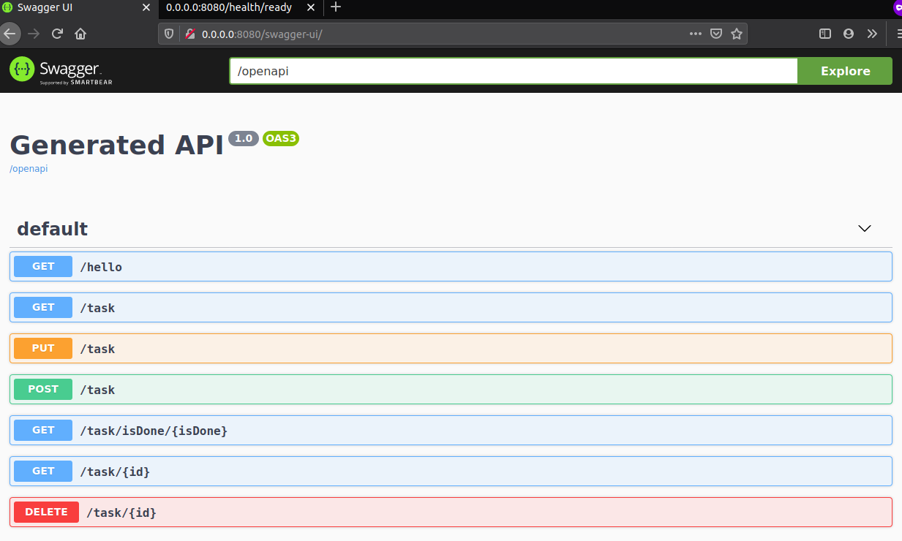

# quarkus-base-mongodb
Quarkus with MongoDB - Simple CRUD

## Projeto base de Quarkus com MongoDB
- @GET | @POST | @PUT | @DELETE
- Quarkus Junit5
- Quarkus MongoDB Panache
- Quarkus MongoDB TestContainers
- Docker
- Quarkus Test Resource
- Quarkus Test Service
- Quarkus Test Repository


#### Tempo de start em 0.023s do projeto nativo em Docker
[]

#### Swagger UI
[]

#### MongoDB
[]

#### Health do projeto online
[]

# quarkus-base-mongodb project

This project uses Quarkus, the Supersonic Subatomic Java Framework.

If you want to learn more about Quarkus, please visit its website: https://quarkus.io/ .

```
@POST save a new Task
{
  "description": "Felipe Quarkus testes criar tarefa",
  "macaddress": "02:15:B2:00:00:00",
  "title": "Quarkus post",
  "type": 0,
  "when": "2020-07-16T20:29:00Z[UTC]"
}
```

## Running maven 
mvn install

## Running the application in dev mode

You can run your application in dev mode that enables live coding using:
```
./mvnw quarkus:dev
```

## Packaging and running the application

The application can be packaged using `./mvnw package`.
It produces the `quarkus-base-mongodb-1.0.0-SNAPSHOT-runner.jar` file in the `/target` directory.
Be aware that it’s not an _über-jar_ as the dependencies are copied into the `target/lib` directory.

The application is now runnable using `java -jar target/quarkus-base-mongodb-1.0.0-SNAPSHOT-runner.jar`.

## Creating a native executable

You can create a native executable using: `./mvnw package -Pnative`.

Or, if you don't have GraalVM installed, you can run the native executable build in a container using: `./mvnw package -Pnative -Dquarkus.native.container-build=true`.

You can then execute your native executable with: `./target/quarkus-base-mongodb-1.0.0-SNAPSHOT-runner`

If you want to learn more about building native executables, please consult https://quarkus.io/guides/building-native-image.


[Udemy Curso Base](https://www.udemy.com/share/102PukAkoYdVxQQnw=/)